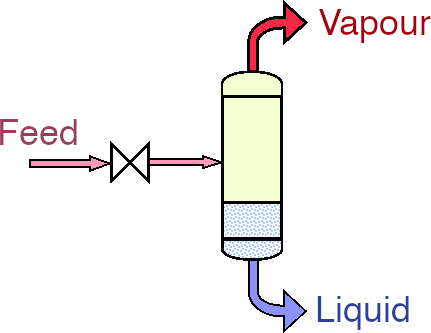
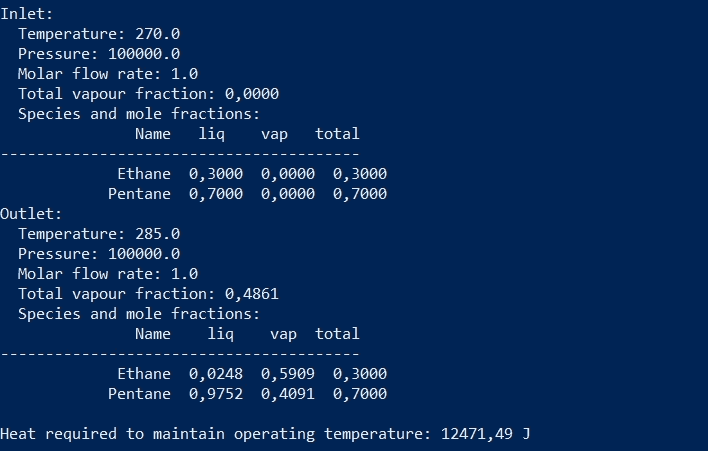
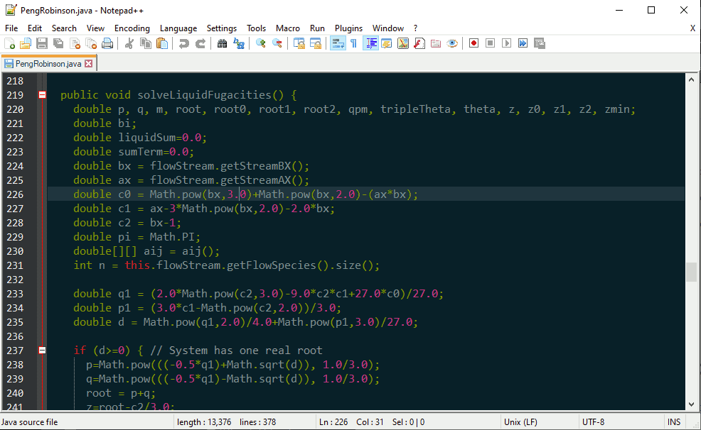

# flash-separation

[Flash distillation](https://en.wikipedia.org/wiki/Flash_evaporation) is a process where a mixture of liquids is partially vaporized by a reduction in pressure. Volatile components will be preferentially vaporized, allowing the mixture to be separated. (Flash distillation is analogous to a single tray of a distillation tower.)

This tool calculates the composition of the output streams of a flash distillation, using either the ideal gas law or the [Peng-Robinson equation of state](https://en.wikipedia.org/wiki/Equation_of_state#Peng%E2%80%93Robinson_equation_of_state). The composition of the inlet streams, as well as the desired temperature and pressure of the outlet, are input, with the outlet compositions output:

# Background

The simulator was written as a project for the course CHG 4343 (Computer-Aided Design in Chemical Engineering) by Nick Boileau, Stephanie Lanctot, Joshua Rico, David Schlachter, and Natalie Woszewska. Detailed thermodynamics calculations are implemented, and results have been validated against external implementations.

To run: download 'flash-separation.jar' from Releases tab, and open with Java Runtime at a command line (e.g. `java -jar flash-separation.jar`).

Development environment: download the project and open 'flash-separation.drjava' in the Dr. Java IDE using 'Project' > 'Open...'. Compile the project, and press 'Run Project' to start the simulation.

Many test cases have been included. These are the classes starting with 'Test_', and their 'test' methods are run when by pressing 'Test Project' in the Dr. Java menubar. If all the tests pass (i.e. assertTrue boolean statements return `true`), then all the tests will appear in green in the 'Test Output' tab. Test cases cover all aspects of the program, including validated solutions to the thermodynamics equations.
